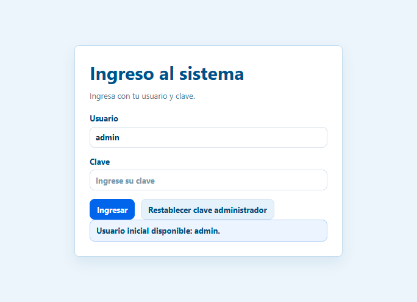
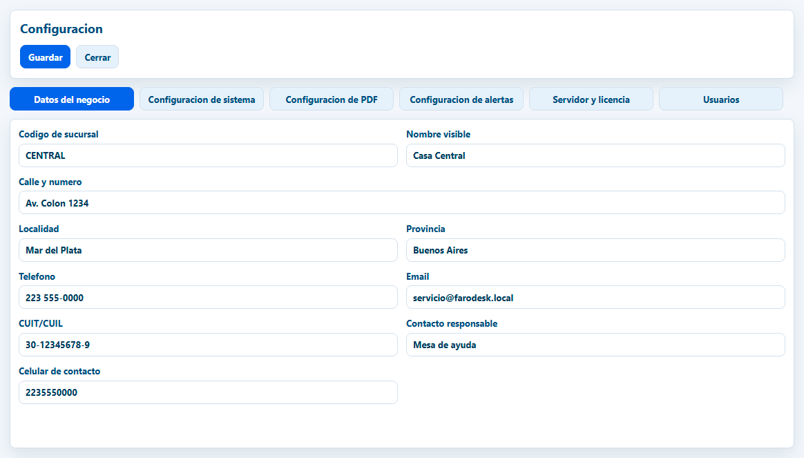
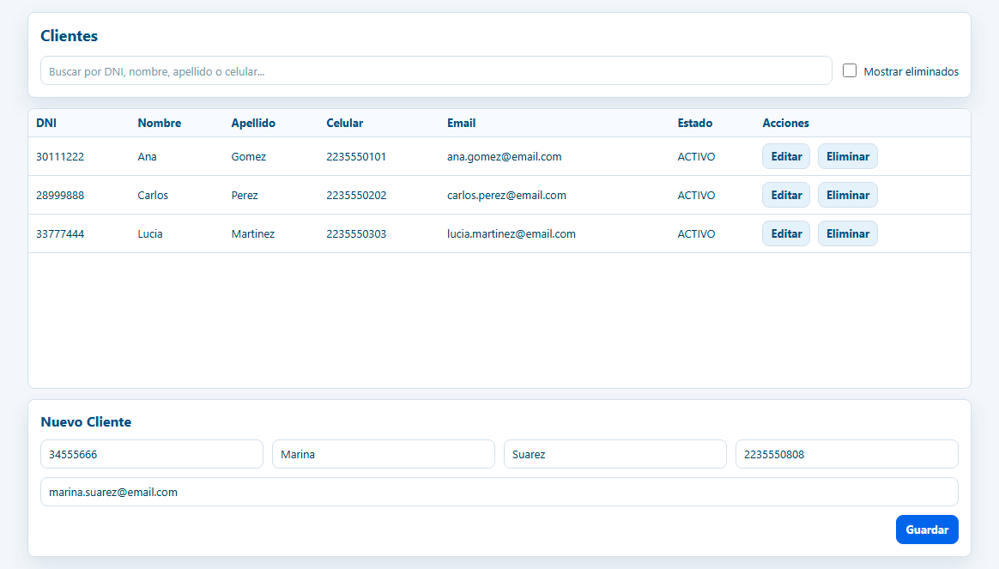
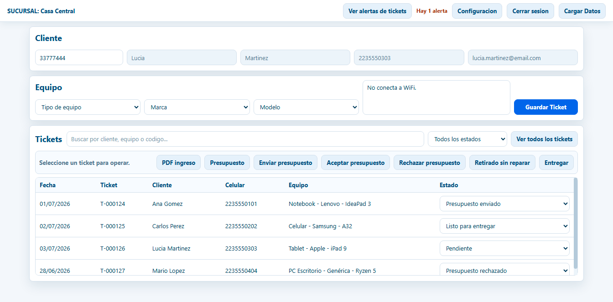
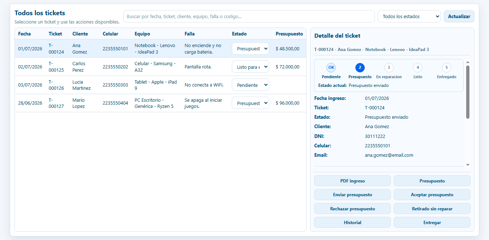
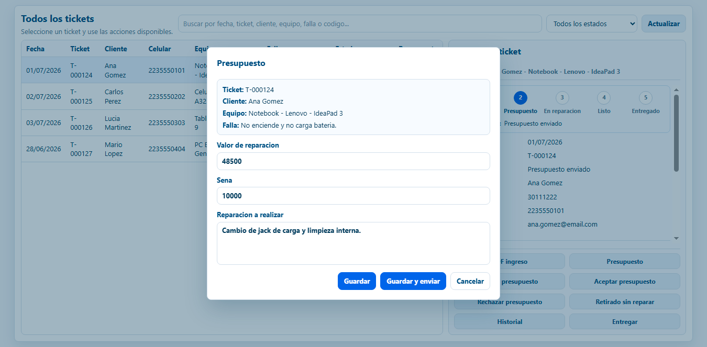
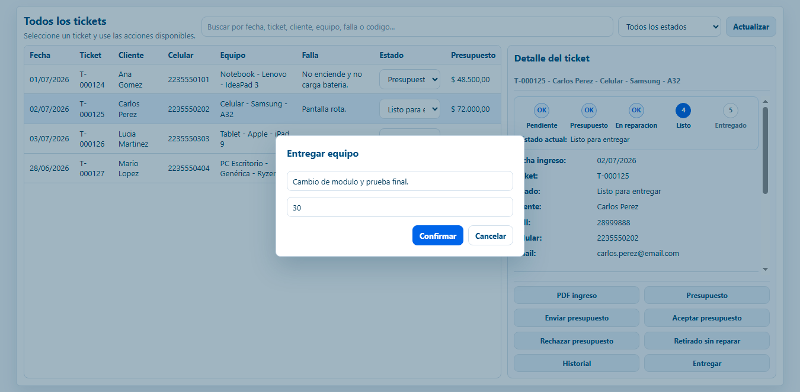
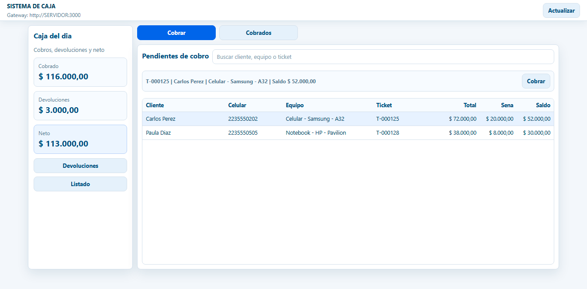
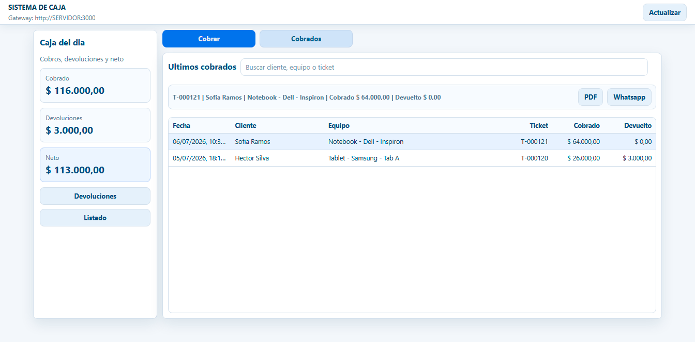

# Manual de usuario - FaroDesk

Este manual explica la instalacion y el uso diario de FaroDesk Tickets y FaroDesk Caja.
Las imagenes incluidas corresponden a pantallas reales de la aplicacion con datos de ejemplo, para que el usuario pueda reconocer facilmente cada paso.

## FaroDesk Tickets

### Indice

1. Instalacion de servidor
2. Instalacion de terminales
3. Configuracion
4. Carga de datos (ABM's)
5. Carga de tickets
6. Como cambiar los estados de un ticket hasta rechazo o cobro en caja

## 1. Instalacion de servidor

La instalacion de servidor se realiza en la PC principal del local. Esa computadora guarda la base de datos, levanta el gateway/API y permite que las terminales se conecten desde la red.

1. Ejecutar el instalador `FaroDeskServidor-Setup-1.0.0.exe`.
2. Aceptar los permisos de administrador cuando Windows los solicite.
3. Elegir la carpeta de instalacion. La ruta recomendada es `C:\mardeltech\sistemadetickets`.
4. Cuando el instalador lo pregunte, dejar marcada la opcion para instalar tambien FaroDesk en ese servidor si esa misma PC se va a usar como terminal.
5. Finalizar la instalacion.

El instalador del servidor prepara PostgreSQL, el gateway y las tareas de inicio automatico. Al finalizar, tambien deja disponible el instalador de terminal para usarlo en otras PCs.

## 2. Instalacion de terminales

La terminal es la PC desde donde el usuario trabaja con Tickets, Caja o ambos modulos.

1. Ejecutar el instalador `FaroDeskTerminal-Setup-1.0.0.exe`.
2. Ingresar el nombre o IP del servidor. Ejemplo: `SERVIDOR`, `192.168.1.10` o el nombre real de la PC principal.
3. Seleccionar los modulos que se desean instalar:
   - `FaroDesk Tickets / Servicio Tecnico`
   - `FaroDesk Caja`
4. Continuar hasta finalizar.

El instalador crea accesos directos separados para Tickets y Caja. Si una PC solo cobra, puede instalar solamente Caja. Si una PC carga y gestiona reparaciones, debe instalar Tickets.

## 3. Configuracion

La configuracion se abre desde el boton `Configuracion` en FaroDesk Tickets. Solo el administrador puede modificar estos datos.

En esta pantalla se configuran:

- Datos del negocio y de la sucursal.
- Formato de fecha y moneda.
- Datos y logo para los PDF.
- Dias de alerta para tickets demorados.
- URL del gateway/API.
- Datos de licencia.
- Usuarios del sistema.

Despues de modificar datos, presionar `Guardar`. Si se cambia la URL del gateway o datos criticos, cerrar y abrir nuevamente la aplicacion para confirmar que conecta correctamente.

## 4. Carga de datos (ABM's)

Desde `Cargar Datos` se administran las tablas basicas del sistema:

- Sucursales.
- Tipos de equipo.
- Marcas.
- Modelos.
- Clientes.

El funcionamiento general de los ABM's es siempre parecido:

1. Buscar si el dato ya existe.
2. Completar los campos del formulario.
3. Presionar `Guardar`.
4. Para modificar un registro, usar `Editar`.
5. Para darlo de baja, usar `Eliminar`.
6. Si corresponde, marcar `Mostrar eliminados` y usar `Reactivar`.

Conviene cargar primero tipos de equipo, marcas y modelos. Luego, al cargar tickets, esos datos aparecen en los combos de seleccion.

## 5. Carga de tickets

La pantalla principal de FaroDesk Tickets permite cargar el cliente, el equipo y la falla informada.

Pasos para cargar un ticket:

1. Ingresar el DNI del cliente.
2. Presionar `Enter` o salir del campo para buscarlo.
3. Si el cliente existe, el sistema completa sus datos.
4. Si el cliente no existe, completar nombre, apellido, celular y email.
5. Seleccionar tipo de equipo, marca y modelo.
6. Escribir la descripcion de la falla.
7. Presionar `Guardar Ticket`.

Al guardar, el sistema genera el codigo del ticket. Desde la grilla se puede generar el `PDF ingreso`, cargar presupuesto, enviar presupuesto, aceptar, rechazar o entregar segun el estado del ticket.

## 6. Estados del ticket hasta rechazo o cobro en caja

La pantalla `Ver todos los tickets` muestra la grilla completa y, a la derecha, el detalle del ticket seleccionado.

Flujo normal hasta cobro:

1. `Pendiente`: el ticket fue cargado y esta a revisar.
2. `Presupuesto enviado`: se cargo y envio el presupuesto al cliente.
3. `En reparacion`: el cliente acepto el presupuesto.
4. `Listo para entregar`: el equipo ya esta reparado.
5. `Entregado`: se confirma la entrega y el ticket pasa a Caja para cobrar.

Para cargar o enviar presupuesto:

1. Seleccionar el ticket.
2. Presionar `Presupuesto`.
3. Cargar valor de reparacion, sena y reparacion a realizar.
4. Presionar `Guardar` o `Guardar y enviar`.
5. Si se envia, el sistema genera el PDF y abre WhatsApp para compartirlo.

Para rechazar un presupuesto:

1. El ticket debe estar en `Presupuesto enviado`.
2. Seleccionar el ticket.
3. Presionar `Rechazar presupuesto`.
4. Confirmar la accion.
5. El estado queda como `Presupuesto rechazado`.

Si el cliente retira el equipo sin reparar:

1. El ticket debe estar en `Presupuesto rechazado`.
2. Presionar `Retirado sin reparar`.
3. Confirmar la accion.
4. El ticket queda cerrado como retirado sin reparar y no sigue el circuito de cobro normal.

Para enviar un ticket a Caja:

1. El ticket debe estar en `Listo para entregar`.
2. Seleccionar el ticket.
3. Presionar `Entregar`.
4. Completar el trabajo realizado y los dias de garantia.
5. Confirmar.
6. El sistema marca el ticket como `Entregado` y lo envia a FaroDesk Caja como pendiente de cobro.

## Faro Desk Caja

### Indice

1. Instalacion
2. Como cobrar un ticket

## 1. Instalacion

FaroDesk Caja se instala con el instalador de terminal.

1. Ejecutar `FaroDeskTerminal-Setup-1.0.0.exe`.
2. Ingresar el nombre o IP del servidor.
3. Seleccionar `FaroDesk Caja`.
4. Finalizar la instalacion.
5. Abrir el acceso directo `FaroDesk Caja`.
6. Iniciar sesion con el usuario asignado.

La Caja toma los tickets que fueron entregados desde FaroDesk Tickets. Si no aparece un ticket en Caja, revisar que el ticket haya sido marcado como `Entregado`.

## 2. Como cobrar un ticket

La pantalla principal de Caja muestra los totales del dia y la lista de tickets pendientes de cobro.

Pasos para cobrar:

1. Abrir `FaroDesk Caja`.
2. En la pestana `Cobrar`, buscar el ticket por cliente, equipo o codigo.
3. Seleccionar el ticket pendiente.
4. Verificar total, sena y saldo.
5. Presionar `Cobrar`.
6. Confirmar el cobro.

Despues de cobrar, el ticket pasa a la pestana `Cobrados`.

Desde `Cobrados` se puede:

- Abrir el comprobante en PDF con `PDF`.
- Enviar el comprobante por WhatsApp con `Whatsapp`.
- Consultar los ultimos cobros realizados.

Los botones `Devoluciones` y `Listado` permiten registrar devoluciones y consultar movimientos de caja cuando sea necesario.
